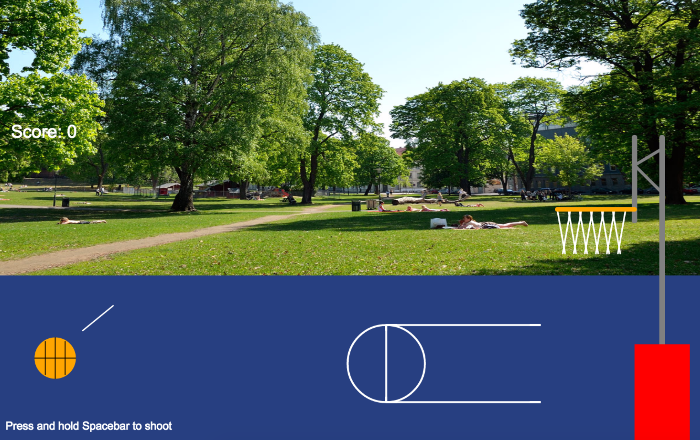

# Canvas-Basketball-Game
HTML/Javascript basketball game using Canvas API

## Motivation
This was my first project after 5 weeks of attending the Galvanize full-stack web development program. Still new to coding at the time, I wanted to challenge myself and try building something that wasn't like the content-based web pages we had been studying. Creating this basketball game was a great way to combine my favorite sport with all the programming concepts I learned such as OOP.
## Screenshot

## Challenges
I underestimated the difficulty of drawing with Canvas all the various shapes and incorporating collision detection. It took a good amount of time to understand how to draw things in Canvas. The Canvas itself acts like an XY-plane with positive Y pointing down. Early on in the project, plenty of errors and debugging occurred with this inverted Cartesian Coordinate System. Shot trajectory/power and collision detection also proved to be difficult. There are still certain areas in the backboard and back of the hoop where the ball doesn't react to collision like I'd want which leads to some interesting animation effects. I initially tried using a Bezier curve for the path the ball would follow after being shot. This made the ball look more like it was riding a rollercoaster so I instead integrated gravity by reducing the Y-velocity after a certain height.
## Technologies
* HTML
* CSS
* Javascript
* Canvas API

## Features
* Collision Detection
* Animated Sprites after making three shots in a row
* Shot power based on time
* Shot trajectory based on indicated angle

## To-Do
* Fix collision detection areas
* Add power meter
* Fix layering for sprites
* Adjust colors

## Link
[Click here to play!](http://canvas-basketball.herokuapp.com/)
